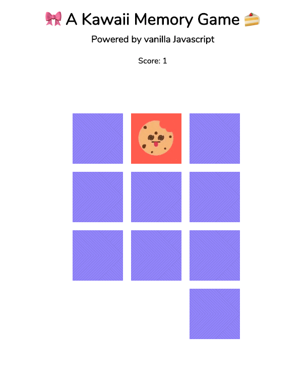

# 🎀 A Kawaii Memory Game 🍰
### Powered by vanilla Javascript

This is a memory game, also known as the concentration card game or matching game, where you need to match pairs by turning over 2 cards at a time. 

The game can be played thanks to GitHub pages here: https://connietran-dev.github.io/memory-game/

This game was built as an exercise in utilizing native Javascript functions based off of a freeCodeCamp tutorial [here](https://www.youtube.com/watch?v=lhNdUVh3qCc).

### Native Javascript Functions

* for loops
* addEventListener
* setAttribute
* getAttribute
* data-attributes
* document.querySelector
* createElement

Enjoy!

